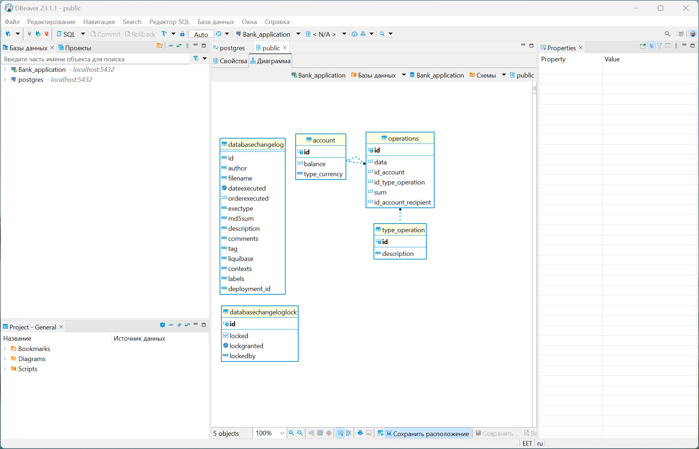

<h1> Bank_application </h1>

   
 <h2>Описание приложения:</h2>
 
Приложение реализует Rest API по работе с банковским счетом. Это API может быть использовано банкоматом, веб-приложением или мобильным приложением Интернет-банка. 

  <h3>В приложении реализованы следующие типы операции:</h3>
  <ul>
     <li>Запроса баланса</li>
     <li>Снятие со счёта денежных средств</li>
     <li>Внесения на счёт денежных средств</li>
     <li>Отображение списка операций за выбранный период</li>
     <li>Перевод определенной суммы между счетами</li>
  </ul>
  <h3>Для работы приложения необходимо:</h3>
       <li><a href="https://en.wikipedia.org/wiki/PostgreSQL">Database PostgresSQL</a></li>
       <h3>Запуск ПО:</h3>
       
Для запуска программы необходимо прописать настройки подключения в файл <b>external.properties</b> который должен находится в корневой папке проекта, либо после сборки приложения этот файл должен лежать в одной папке с jar файлом приложения.
       В этом файле укажите название базы данных, которая должна быть создана заранее(
         <code>spring.datasource.url=jdbc:postgresql://localhost:5432/Bank_application</code>).
         При старте приложение, в этой базе данных, автоматически создаются таблицы ACCOUNT, OPERATIONS и TYPE_OPERATION где и будут храниться данные пользователя(<i>номер счёта, баланс, тип валюты</i>), данные выполненных операций(<i>дата, номер счёта, тип операции, сумма операции, номер счёта получателя(если это операция перевода)</i>) и перечень возможных операций. Обращаясь к
         контроллерам по их адресу реализуется выше указанный типы операции.

         <h3>В приложении так же реализовано:</h3>
    <ul>
       <li>Логирование с использованием log4j2</li>
          
Настройки логирование находятся в файле <b>log4j2-spring.xml</b>.
          Сами логи пишутся в файл <b>application.log</b>, который лежит в папке <code>logs</code>.

       <li><a href="https://swagger.io/solutions/api-documentation/">Swagger</a></li>
            
Фреймворк Swagger позволяет разработчикам создавать интерактивную, удобочитаемую для машин и человека документацию по API.
            Swagger доступен при запущенном приложении по адресу:<a href="http://localhost:8080/swagger-ui/index.html#/"> http://localhost:8080/swagger-ui/index.html#/</a>.

       <li>Тестирование</li>
            
Тестирование проходит в тестовой базе данных, на тестовых данных. Настройки подключение лежат в файле <b>application.properties</b> по адресу <code>Bank-application\src\test\resources</code>. В этом файле укажите название базы данных, которая должна быть создана заранее.

       <li>Система контроля версии БД с использованием <a href="https://www.liquibase.com/">Liquibase</a></li>
           
В процессе реализации поставленной задачи было необходимо регулярно дорабатывать БД. Что бы этот процесс был легко отслеживаемым, управляемым и 
               безопасным в проект было внедрено это программное обеспечение. Для легкого создания сценария миграции базы данных для Liquibase использовался плагин 
               <a href="https://jpa-buddy.com/">JPA Buddy</a>.

       <li>Развёрнута база данных и Rest API на удаленном сервере</li>
            
По <b>http://84.54.44.81:8080/</b> обращаясь к контроллерам по их адресам получаем доступ к ним. Пример : <a href="http://84.54.44.81:8080/api/getBalance_for_id/1000"> http://84.54.44.81:8080/api/getBalance_for_id/1000</a>.

    </ul>
<h3>Cкриншот структуры базы данных:</h3>

  
 
 

 
